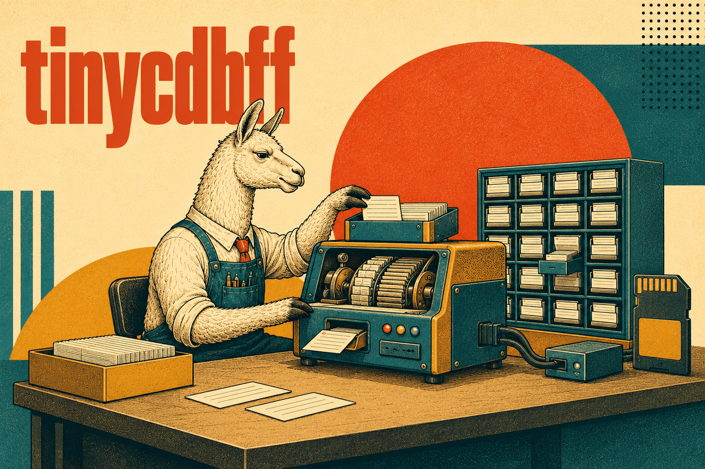

<p align="center">
  
</p>

# tinycdbff — CDB for Chan FatFs

[](https://github.com/cindustries/tinycdbff/actions/workflows/compile-check.yml)
[](LICENSE)

A port of Michael Tokarev's [**TinyCDB**](http://www.corpit.ru/mjt/tinycdb.html)
— itself an implementation of D. J. Bernstein's [**cdb**](https://cr.yp.to/cdb.html)
constant database — to [**Chan FatFs**](http://elm-chan.org/fsw/ff/00index_e.html),
the generic FAT filesystem module for small embedded systems.

It lets a microcontroller keep a **read-only key/value index on an SD card** (or any
FatFs volume): build the database once, then do fast, allocation-free lookups — no
POSIX, no heap for reads, no external dependencies beyond FatFs itself.

## What is a constant database?

A cdb is an on-disk hash table that is **written once and never modified**. Creation
streams every record to the file and then lays down a two-level hash index; lookups
follow the djb hash into that index and read the value straight off storage. The
result is small, fast and simple:

- **O(1) average lookups** with at most two disk seeks per hit.
- **No in-memory index** — the hash tables live in the file, so a reader needs only
  a `FIL` handle and a few bytes of stack.
- **Immutable after creation** — no locking, no compaction, no corruption from a
  half-written update. To change the data, rebuild the file.

The on-disk layout is the classic cdb format (a 2048-byte table of contents,
little-endian 4-byte integers, djb hash), so files stay **format-compatible** with
djb cdb and upstream tinycdb.

## How it fits: the FatFs seam

Upstream tinycdb talks to POSIX file descriptors. This port routes every read and
write through Chan FatFs instead — `f_open` / `f_read` / `f_write` / `f_lseek` on a
`FIL *`. That is the whole adaptation: give it an open `FIL` and it works on whatever
FatFs works on, with no `<unistd.h>` and no hosted C library beyond `string.h`,
`stdlib.h` and `errno.h`.

## Status & scope

**tinycdbff is a source-drop module, not a built library.** You vendor the `cdb_*.c`
files into your firmware tree and compile them alongside a real Chan FatFs that
supplies `ff.h`. Nothing here is built, installed or published on its own — there is
no shared object, no package, no `make install`.

## Integration

Drop the sources into your tree and add them to your build. A typical Makefile
fragment:

```make
TINYCDBFF_DIR       ?= ./tinycdbff
TINYCDBFF_INCLUDE    = $(TINYCDBFF_DIR)
TINYCDBFF_SOURCE_DIR = $(TINYCDBFF_DIR)/
TINYCDBFF_SOURCE     = \
  cdb_hash.c \
  cdb_make_add.c \
  cdb_make.c \
  cdb_make_put.c \
  cdb_seek.c \
  cdb_unpack.c

CFLAGS              += -I$(TINYCDBFF_INCLUDE)

EXTRA_SOURCE        += $(addprefix $(TINYCDBFF_SOURCE_DIR), $(TINYCDBFF_SOURCE))
```

`cdb.h` includes `ff.h`, so your include path must already reach Chan FatFs.

## Usage

### Reading

Open the file yourself with FatFs, then let cdb seek to the value:

```c
#include "ff.h"
#include "cdb.h"

FIL file;
unsigned datalen;

f_open(&file, "DATA.CDB", FA_READ);

if (cdb_seek(&file, key, keylen, &datalen) > 0) {
  /* found: file is now positioned at the value, datalen holds its length */
  char *data = malloc(datalen + 1);
  cdb_bread(&file, data, datalen);
  data[datalen] = '\0';
  printf("key=%s data=%s\n", key, data);
  free(data);
} else {
  printf("key=%s not found\n", key);
}

f_close(&file);
```

`cdb_seek` returns `> 0` on a hit (and sets `datalen`), `0` when the key is absent,
and `< 0` on an I/O error.

### Writing

Create the file, stream records into it, then finalize — `cdb_make_finish` is what
writes the hash index and makes the file valid:

```c
#include "ff.h"
#include "cdb.h"

FIL file;
FRESULT fr;
struct cdb_make cdbm;

fr = f_open(&file, "NEW.CDB", FA_READ | FA_WRITE | FA_CREATE_ALWAYS);
if (fr != FR_OK) return -1;              /* could not open for writing */

cdb_make_start(&cdbm, &file);

while (have_more_data()) {
  /* set up key / keylen / data / datalen ... */
  if (cdb_make_exists(&cdbm, key, keylen) == 0)
    cdb_make_add(&cdbm, key, keylen, data, datalen);
    /* or cdb_make_put(&cdbm, key, keylen, data, datalen, mode) */
}

cdb_make_finish(&cdbm);                  /* writes the index — required */
f_close(&file);
```

## API at a glance

Full signatures are in [`cdb.h`](cdb.h).

| Reader | |
|---|---|
| `cdb_seek(fd, key, klen, &dlen)` | Look up `key`; `>0` found (sets `dlen`, positions `fd` at the value), `0` not found, `<0` error. |
| `cdb_bread(fd, buf, len)` | Read the located value; `0` on success, `<0` on error. |

| Writer | |
|---|---|
| `cdb_make_start(m, fd)` | Begin building into an opened, writable, truncated file. |
| `cdb_make_add(m, key, klen, val, vlen)` | Append a record unconditionally. |
| `cdb_make_exists(m, key, klen)` | `1` if the key was already added, `0` if not, `<0` error. |
| `cdb_make_put(m, key, klen, val, vlen, mode)` | Add under a put mode (below). |
| `cdb_make_finish(m)` | Write the hash tables and TOC. **Must** be called. |

| Put mode | Behaviour |
|---|---|
| `CDB_PUT_ADD` | Add unconditionally (duplicates allowed). |
| `CDB_PUT_INSERT` | Add only if the key is not already present. |
| `CDB_PUT_REPLACE` | Replace: the old record is dropped from the index. |
| `CDB_PUT_WARN` | Add unconditionally, but return `1` if the key already existed. |
| `CDB_PUT_REPLACE0` | Like `REPLACE`, but overwrite the old record with zeros. |

Common primitives — `cdb_hash`, `cdb_pack`, `cdb_unpack` — expose the djb hash and
the little-endian 4-byte pack/unpack used by the format.

## Testing

The sources are a drop-in module: a real build links them against Chan FatFs. To
catch breakage without vendoring all of FatFs, `t/compile-check.sh` syntax-checks
every source against a minimal, opaque FatFs stub (`t/ff.h`):

```sh
sh t/compile-check.sh
```

This also runs on every push and pull request via GitHub Actions.

> **Note:** the compile-check proves the sources *compile*, not that the index
> *works* — broken and correct logic produce an identical green run. Exercising cdb
> behaviour (round-trips, put modes, error paths) needs a real FatFs and storage, or
> an in-memory FatFs shim.

## Portability

The consumer is bare-metal or RTOS Chan FatFs, so the code stays within `string.h`,
`stdlib.h` and `errno.h` — no `<unistd.h>` or other hosted-only headers. `FIL` is
only ever used through a pointer, so nothing here depends on the FatFs configuration.

## License

Public domain — see [LICENSE](LICENSE) (The Unlicense). Based on tinycdb by Michael
Tokarev (public domain), which implements cdb by D. J. Bernstein; Chan FatFs port by
Torsten Raudssus. Every source file carries the same public-domain dedication in its
header.

## Support

- IRC: **#hardware** on **irc.perl.org**
- [Report issues on GitHub](https://github.com/cindustries/tinycdbff/issues)
